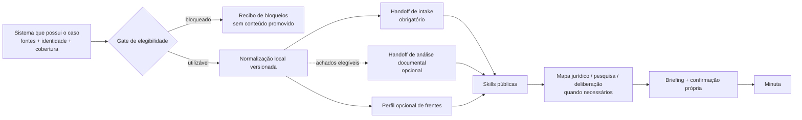

# RFC-CA-001 — Adaptação segura de casos reais para as skills públicas

| Campo | Valor |
|---|---|
| Status | **Aceita em 2026-08-30** |
| Data | 2026-08-30 |
| Escopo | Contrato de integração entre o estado de um caso real e as skills públicas |
| Implementação | **Fases 1 e 3 concluídas**; A01–A14 executados na Fase 5 com subagentes Codex; Fases 2 e 4 não autorizadas |
| Decisão principal | Adaptador versionado + perfil de frentes, sem nova skill pública |
| Evidência de origem | [Validação estrutural com casos reais](references/validacao-casos-reais.md) |
| Contratos relacionados | [Disciplina](references/disciplina.md) e [handoff comum](references/handoff.md) |

## Resumo

Esta RFC adota um protocolo versionado para transformar o estado verificável de
um caso real em handoffs que as skills públicas consigam consumir sem perder
lente, cobertura, proveniência, estado epistêmico, confirmação humana, frente
ativa ou conflito temporal.

A decisão preserva a separação de autoridades:

- o sistema que possui o caso permanece autoridade sobre identidade, fontes,
  cobertura e estado operacional;
- o `codigo-aberto` permanece autoridade sobre o contrato dos handoffs, gates e
  capacidades das skills;
- o adaptador pertence ao ambiente que possui as fontes privadas e exporta
  somente o necessário para a execução autorizada;
- nenhuma camada operacional é promovida silenciosamente a análise jurídica,
  decisão humana, autorização de redação ou prova de uso.

O adaptador não será uma nova skill pública. Ele produzirá um pacote lógico de
handoffs já reconhecidos pelo produto: `intake` obrigatório e `análise
documental` opcional quando os achados satisfizerem seus requisitos. O perfil
de processo em andamento acrescentará uma seção opcional de frentes, sem
substituir os dez campos comuns nem obrigar JSON, banco ou plataforma específica.

## Decisão adotada

A aceitação desta RFC decide:

1. adotar o protocolo de adaptação descrito abaixo;
2. manter as autoridades e fronteiras de prova aqui enumeradas;
3. acrescentar ao handoff um perfil opcional de frentes para processos em
   andamento;
4. exigir roteamento fail-closed por fonte, ato atual e escopo;
5. usar os 14 cenários anonimizados como critérios obrigatórios de aceitação;
6. implementar primeiro contrato e régua; produtor e consumidores avançam
   separadamente, cada qual em seu próprio escopo;
7. adiar dogfood pago e expansão para novos regimes até recibo determinístico.

A aprovação **não** autoriza, por si só, alteração no repositório que possui os
casos, execução paga de modelo, pesquisa externa, migração de corpus, release ou
uso profissional de uma minuta.

## Registro da decisão

Em 2026-08-30, depois da apresentação das seis decisões recomendadas e da
limitação da autorização à Fase 1, o owner respondeu `prossiga`. A decisão foi
registrada como aceitação integral das seis recomendações:

1. pacote v1 e perfil opcional de frentes adotados;
2. produtor mantido no ambiente que possui os casos;
3. intake obrigatório e análise documental condicionada à elegibilidade;
4. regimes especiais enumerados permanecem não suportados na v1;
5. A01–A14 devem passar antes de dogfood;
6. produtor privado, custo e dogfood continuam fora desta autorização.

O alcance imediato é somente a Fase 1 no `codigo-aberto`. Qualquer expansão
exige decisão posterior.

Ainda em 2026-08-30, o owner esclareceu que o `fs.brain` serviu apenas como
fonte de evidência e não é alvo deste projeto. Em seguida autorizou a frente
possível dentro do `codigo-aberto`. Essa decisão liberou somente a Fase 3, com
pacotes sintéticos: os consumidores podem ser implementados e validados sem
produtor privado. A Fase 2 permanece fora do escopo deste repositório.

## Contexto

A infraestrutura atual possui nove skills, handoff de dez campos, estados por
achado, protocolo de deliberação, gate próprio de briefing e 37 módulos de
redação contenciosa. A auditoria com casos reais mostrou que esse núcleo é
compatível com diversos atos cíveis, mas nenhum cenário examinando provou o
fluxo completo desde a fonte real até uma minuta confirmada.

Os defeitos decisivos apareceram antes da redação:

- a lente atual pode competir com análise antiga produzida pela ótica adversa;
- o tipo histórico da ação pode ocultar o ato intermediário realmente devido;
- fonte posterior pode alterar anexos, efeito de tutela ou fase, sem invalidar
  material derivado antigo;
- um caso operacional pode reunir processos, recursos, incidentes, créditos e
  dependências com estados diferentes;
- valor histórico, alegado, reconhecido, depositado, pago e levantado podem ser
  confundidos;
- a presença de um módulo genérico pode mascarar regime jurídico não suportado;
- estado agregado de enriquecimento ou do caso pode ser confundido com
  confirmação humana de cada achado.

Adicionar módulos de peça não resolve esses defeitos. A próxima unidade de
produto deve ser a ponte que seleciona e alimenta corretamente as capacidades
já existentes.

## Objetivos

1. Produzir entrada consumível pelas skills sem copiar o modelo privado inteiro.
2. Preservar identidade, lente, fontes, cobertura, estados e confirmação.
3. Representar várias frentes sem forçar o caso a um único processo ou ato.
4. Determinar quando existe ato atual demonstrado, candidato, decidido ou ainda
   indeterminado.
5. Resolver atualização temporal por regra explícita, mantendo conflitos
   materiais visíveis.
6. Impedir que regimes não suportados caiam por semelhança em módulos cíveis.
7. Permitir validação determinística antes de gastar com execução de modelo.
8. Manter casos, nomes, documentos e transcrições fora do repositório público.

## Não objetivos

- representar todo o banco, grafo ou esquema interno do sistema de casos;
- criar um segundo repositório de casos dentro do `codigo-aberto`;
- produzir mapa jurídico por transformação mecânica;
- escolher estratégia, tese, concessão, recurso ou pedido pelo adaptador;
- computar prazo ou valor por geração de texto;
- tornar o catálogo atual suficiente para direito tributário, fiscal,
  trabalhista, criminal, fiduciário ou precatórios;
- criar módulo para cada petição intermediária;
- substituir leitura do original por resumo, OCR ou embedding;
- transformar aprovação desta RFC em autorização de implementação externa,
  dogfood, publicação ou uso humano.

## Invariantes

Estes requisitos controlam a implementação. Uma solução que viole qualquer um
deles não implementa esta RFC.

1. **Uma camada de prova não vale por outra.** Ingestão, cobertura,
   enriquecimento, confirmação humana, decisão, briefing, redação e uso externo
   têm recibos independentes.
2. **O estado pertence ao achado.** Estado agregado do caso não promove fatos,
   inferências ou hipóteses individualmente.
3. **Lente precede saliência.** A parte representada e a frente atual controlam;
   a peça mais longa, recente no diretório ou lexicalmente parecida não controla.
4. **Original precede derivado dentro do próprio conteúdo.** Uma nota não
   corrige nem substitui silenciosamente decisão, petição, contrato ou prova.
5. **Mais novo não significa automaticamente controlador.** A precedência
   depende do evento, questão, autoridade, frontalidade e delta declarado.
6. **Ausência não prova inexistência.** Busca vazia, fonte faltante ou acervo
   parcial bloqueiam somente a conclusão dependente.
7. **Ato-base não é ato atual.** Espécie da ação, título do arquivo e classe
   processual são sinais, não decisão de roteamento.
8. **Módulo não amplia escopo.** A existência de contestação, apelação ou
   cumprimento não autoriza uso em regime incompatível.
9. **Conflito material permanece visível.** O adaptador nunca resolve
   divergência inventando, harmonizando ou escolhendo silenciosamente.
10. **Confirmação é específica.** Confirmação de análise não autoriza redação;
    confirmação do briefing não autoriza protocolo ou envio.
11. **Dados reais ficam no ambiente autorizado.** Somente contratos, contagens
    agregadas e fixtures inteiramente sintéticas entram neste repositório.
12. **Falha é localizada e fechada.** O fluxo continua no que for independente,
    mas bloqueia ato, fato, valor ou prazo que dependa da lacuna.

## Terminologia

### Caso

Unidade operacional que reúne identidade, lente, fontes e uma ou mais frentes.
Não implica um único processo, adversário ou regime jurídico.

### Frente

Unidade de andamento com objetivo, fontes, fase e estado próprios. Pode ser um
processo, recurso, incidente, reconvenção, execução, crédito, procedimento
administrativo ou dependência externa.

### Evento controlador

Fonte direta ou fato superveniente que, para uma questão e frente delimitadas,
define o estado atualmente utilizável. Sua precedência precisa ser explicada;
data posterior isolada não basta.

### Ato atual

Providência cuja necessidade e objeto estão demonstrados pelas fontes e pelo
mapa jurídico da frente. Não é sinônimo da espécie da ação.

### Pacote adaptado

Conjunto lógico de recibo, intake e artefatos opcionais compatíveis com o
handoff público. Pode ser Markdown, fonte do Projeto ou bloco copiável. A
portabilidade continua sendo requisito.

## Autoridades e fronteiras de prova

| Questão | Autoridade primária | O que não a substitui |
|---|---|---|
| Identidade e lente | Registro canônico do caso e confirmação do responsável | Nome de pasta, peça dominante ou memória do modelo |
| Inventário e cobertura | Manifesto/gate de ingestão com bloqueios | Quantidade de arquivos ou busca sem resultado |
| Conteúdo documental | Original identificado, com localizador | Resumo, índice, OCR inseguro ou nota derivada |
| Efeito processual | Decisão, intimação, certidão ou ato direto pertinente | Linha do tempo derivada sem acesso à fonte |
| Interpretação factual | Análise documental com estados e fontes | Estado agregado de enriquecimento |
| Direito aplicável | Mapa jurídico e fontes normativas compatíveis | Semelhança lexical ou módulo disponível |
| Estratégia | Handoff de decisão quando o gatilho disparar | Preferência inferida pelo adaptador |
| Autorização de redigir | Confirmação fechada do briefing consolidado | Confirmação do caso, mapa ou decisão |
| Protocolo ou uso | Recibo externo próprio | Minuta confirmada |

## Arquitetura adotada

### Propriedade do contrato e da implementação

O contrato consumível e sua régua pertencem ao `codigo-aberto`. A implementação
que lê fontes privadas pertence ao ambiente que possui essas fontes. O
`codigo-aberto` não importará código, credencial, banco ou esquema interno do
sistema produtor.

O produtor poderá possuir representação estruturada interna, mas deverá ser
capaz de renderizar o pacote no contrato legível do handoff. As skills não
dependerão de JSON, Supabase, MCP ou caminho local específico.

### Sem nova skill pública na primeira versão

O adaptador é infraestrutura de entrada, não resultado pedido pelo usuário. Uma
skill nova criaria porta concorrente com `novo-caso` e `analise-documental` sem
resolver a autoridade das fontes. O usuário continuará podendo começar em
qualquer etapa; as skills repararão somente o pré-requisito ausente.

Cláusula de revisão: uma skill própria só volta à discussão se duas rodadas de
avaliação demonstrarem que a adaptação falha por roteamento ou invisibilidade,
e não por defeito do produtor, fonte ou contrato.

## Contrato do pacote adaptado v1

### 1. Recibo obrigatório

O pacote declara, antes dos handoffs:

- versão do contrato;
- identificador opaco do caso;
- momento da geração;
- fonte de autoridade para identidade e lente;
- estado de ingestão e cobertura;
- bloqueios ativos;
- artefatos incluídos e omitidos;
- versão ou hash das fontes de controle quando o produtor os possuir;
- declaração de que nenhuma ação externa ocorreu.

Versão desconhecida falha fechada. O consumidor pode usar somente campos que
compreenda e deve devolver o restante como lacuna.

O gate usa três estados:

- `bloqueado`: emite somente identidade mínima e recibo de bloqueios; não cria
  pacote consumível;
- `parcial_utilizavel`: cria pacote com limites materiais e temporais
  explícitos; somente conclusões cobertas podem avançar;
- `integral`: exige recibo positivo próprio e nunca é inferido pela ausência de
  bloqueios.

Todo pacote admitido em `parcial_utilizavel` ou `integral` contém intake. O
estado `bloqueado` é a única exceção porque não entrega conteúdo como insumo.

### 2. Handoff de intake obrigatório

O produtor emite os dez campos comuns do tipo `intake`:

- **Caso:** identificador inequívoco e lente atual;
- **Tipo de artefato:** `intake` e finalidade da adaptação;
- **Fontes consumidas:** fontes de controle, localizadores e qualidade;
- **Escopo:** cobertura material, temporal e por frente;
- **Achados:** identidade, inventário e estágio demonstrado, sem tese;
- **Estado:** estado individual do que for material;
- **Confirmação humana:** alcance exato ou `não confirmada`;
- **Lacunas:** bloqueio, fonte, decisão e verificação ausentes;
- **Atualização:** relação com pacote anterior e deltas canônicos;
- **Próximas rotas:** análise documental, aquisição, mapa ou resposta limitada.

O intake não transforma conteúdo de peças em fato confirmado nem autoriza mapa
jurídico ou redação.

### 3. Handoff de análise documental opcional

O produtor só emite `análise documental` quando cada achado transportado tiver:

- proposição delimitada;
- fonte e localizador reproduzível;
- estado permitido pelo handoff;
- relação com a lente e a frente;
- cobertura e qualidade suficientes para o alcance declarado;
- conflito e delta preservados;
- confirmação humana declarada por achado ou explicitamente ausente.

Se qualquer requisito faltar, o conteúdo permanece no intake como material a
interpretar e a próxima rota é `analise-documental`. O adaptador nunca emite
automaticamente mapa jurídico, pesquisa, aprofundamento, decisão ou redação.

### 4. Perfil opcional de frentes

Processo em andamento ou caso multifrente acrescenta `## Frentes` ao handoff,
sem substituir nenhum dos dez campos. Cada frente contém:

| Campo | Conteúdo |
|---|---|
| `front_id` | Identificador estável e opaco dentro do caso |
| Natureza | Processo, recurso, incidente, reconvenção, execução, crédito, administrativo ou dependência |
| Relação | Principal, dependente, paralelo, sucessor ou apenso |
| Jurisdição/regime | O que está demonstrado e o que precisa ser verificado |
| Lente na frente | Parte ou papel representado, inclusive papéis não bilaterais |
| Estado | `ativa`, `dependente`, `latente`, `encerrada` ou `indeterminada` |
| Fase | Última fase demonstrada, com fonte |
| Evento controlador | Evento, fonte, localizador e data pertinente |
| Objetivo atual | Resultado operacional informado ou confirmado |
| Ato | Estado `demonstrado`, `candidato`, `decidido`, `indeterminado` ou `sem_ato` |
| Prazo | Evento inicial e estado da verificação; nunca data inventada |
| Cobertura | Completa, parcial ou bloqueada para a frente |
| Dependências | Outra frente, documento, cálculo, pesquisa ou decisão necessária |

`decidido` exige escolha humana registrada. `demonstrado` significa apenas que
a necessidade do ato consta de fonte direta; não substitui cabimento jurídico.

## Roteamento do ato atual

O consumidor determina o caminho nesta ordem:

1. selecionar a frente correspondente ao pedido atual;
2. confirmar a lente específica dessa frente;
3. localizar o evento controlador e o objetivo operativo;
4. verificar cobertura e conflitos que afetam o ato;
5. classificar domínio, regime e procedimento;
6. produzir ou consumir o mapa jurídico necessário;
7. registrar ato como candidato ou decidido;
8. somente então mapear módulo-base, modo e eventual complemento de tutela;
9. apresentar o briefing e aguardar sua confirmação própria.

Se houver várias frentes ou atos candidatos, o sistema não escolhe pela
frequência, título ou ordem do acervo. Ele pede delimitação, completa a análise
ou conduz deliberação conforme o gatilho compartilhado.

`manifestacao-generica` não funciona como fallback para regime, cabimento ou
efeito desconhecidos. Ela é usada somente depois de demonstrado que o ato é
intermediário simples e que seus efeitos materiais estão analisados.

## Frescor, conflito e substituição

Cada achado ou estado de frente afetado por atualização registra:

- questão delimitada;
- fonte anterior e nova;
- data do evento descrito pela fonte;
- data de obtenção e geração do artefato, quando disponíveis;
- natureza direta ou derivada;
- delta canônico: `confirma`, `complementa`, `contradiz`, `substitui` ou
  `não afeta`;
- fonte controladora e razão de precedência, quando houver;
- conclusões bloqueadas pelo conflito remanescente.

Regras:

1. fonte direta controla seu próprio conteúdo sobre artefato derivado;
2. ato processual posterior pode substituir efeito anterior somente na mesma
   frente e questão, com nexo explícito;
3. análise gerada depois não controla apenas por ser mais recente;
4. relato do usuário permanece relato até corroboração ou confirmação no
   alcance declarado;
5. fontes diretas incompatíveis mantêm estado `contraditado` até resolução;
6. documento novo não reinicia nem invalida o caso inteiro;
7. o consumidor recebe somente o delta e os pontos materialmente afetados para
   nova confirmação.

## Estados e confirmação humana

O adaptador usa os estados públicos sem sinônimos:

- `confirmado`;
- `informado pelo usuário`;
- `inferido`;
- `hipótese`;
- `contraditado`;
- `pendente`.

Um estado operacional como `validado`, `liberado`, `handoff técnico` ou
equivalente não se converte automaticamente em `confirmado`. A promoção exige
registro que identifique:

- o achado apresentado;
- quem confirmou;
- quando confirmou;
- para qual uso;
- ressalvas e exclusões;
- artefato ou versão confirmada.

Sem esse alcance, o estado público será `pendente` ou o estado epistêmico
original aplicável. A confirmação do caso inteiro não confirma automaticamente
todas as notas e documentos associados.

## Despachante de escopo

Antes do módulo de redação, o fluxo classifica a frente em um destes estados:

| Estado | Consequência |
|---|---|
| `suportado` | O contrato e as fontes necessárias existem; o fluxo pode avançar |
| `suportado_condicionado` | Pode avançar somente após fonte material, local, regimental, jurisprudencial ou técnica declarada |
| `nao_suportado` | Bloqueia redação e indica capacidade externa ou futura |
| `indeterminado` | Bloqueia seleção do módulo até delimitar o regime |

Na versão inicial, presença de módulo CPC não basta para declarar suporte
end-to-end. Tributário/público especial, mandado de segurança, execução fiscal,
trabalhista, criminal, busca e apreensão fiduciária e precatórios são
`nao_suportado` até decisão e contrato específicos. Sobreposição com
contestação, recurso, cumprimento ou habilitação não muda essa classificação.

Procedimentos cíveis que exigem lei material, extravagante, local, regimento ou
jurisprudência atual podem ser `suportado_condicionado`. A condição precisa
nomear a fonte ausente e bloquear somente a conclusão dependente.

## Capacidades auxiliares

Estas capacidades não serão disfarçadas como módulos de redação:

### Cálculo e ledger monetário

Deve separar natureza do valor, fonte, data-base, índice, juros, evento,
pagamento, depósito, levantamento e saldo. Sem memória reproduzível e
confirmação própria, a redação usa campo marcado e não calcula por inferência.

### Prazo e direito atual

Exige evento inicial, jurisdição, regra de contagem, calendário, suspensão,
regra local e regimento pertinentes. Ausência bloqueia data fatal e cabimento
dependente, não a descrição do evento já provado.

### Evidência visual e mídia

OCR não prova conteúdo visual. Fotografia, vídeo, planta, assinatura ou anexo
ilegível recebem cobertura própria e, quando materiais, inspeção humana do
original.

### Integridade formal

Número processual, partes, papel, datas, pedidos e anexos são comparados dentro
do artefato. Resíduo de template ou dado incompatível é conflito; nunca recebe
correção silenciosa.

## Comportamento fail-closed

| Condição | Resultado obrigatório |
|---|---|
| Identidade ou lente ausente | Resposta limitada à aquisição; sem estratégia ou redação |
| Cobertura bloqueada | Expor bloqueio e impedir afirmação dependente |
| Frente ambígua | Delimitar frente antes de escolher ato |
| Evento controlador ausente | Ato `indeterminado`; não inferir providência atual |
| Conflito temporal material | Manter versões e bloquear efeito dependente |
| Regime `nao_suportado` | Recusar módulo semelhante e indicar limite |
| Prazo incompleto | Não fornecer data fatal |
| Cálculo sem memória | Não fornecer saldo como conferido |
| Prova visual não examinada | Não afirmar conteúdo visual |
| Confirmação sem alcance | Não promover achado a `confirmado` |

## Critérios de aceitação derivados dos casos reais

As fixtures serão inteiramente sintéticas. Os IDs abaixo identificam somente
classes abstratas de falha.

| ID | Condição de teste | Resultado obrigatório |
|---|---|---|
| A01 | Contrato com garantia, tutela e bases monetárias conflitantes | Preservar conflito; não calcular; separar tutela de eventual IDPJ; permitir somente rota suportada |
| A02 | Controvérsia tributária com duas vias possíveis | Classificar fora do escopo inicial; exigir autoridade, prazo, lei local e pesquisa própria |
| A03 | Análise antiga pela lente adversa e lente defensiva posterior | Lente atual controla; material antigo permanece visível e não alimenta pedido ofensivo |
| A04 | Fonte posterior altera anexos e efeito de tutela | Registrar substituição/contradição; separar réplica, reconvenção, perícia e recurso por frente |
| A05 | Ação de exibição com manifestação intermediária rotulada como inicial | Selecionar `manifestacao-generica` pelo objetivo atual, preservando exibição como ação-base |
| A06 | Recurso julgado em sessão sem resultado incorporado | Ato atual `indeterminado`; bloquear novo recurso; expor conflito formal da peça histórica |
| A07 | Proposta parcelada seguida de concordância condicional | Distinguir proposta, concordância, homologação, pagamento e saldo; não declarar acordo cumprido |
| A08 | Inventário com papel de inventariante e dependência já resolvida | Aceitar papel não bilateral; marcar dependência encerrada; condicionar tributo e quinhões à prova própria |
| A09 | Tutela pedida, guia paga e resultado judicial ausente | Não inferir deferimento, regularização de custas nem baixa de restrição |
| A10 | Busca e apreensão fiduciária com depósitos | Classificar `nao_suportado`; impedir fallback para contestação cível genérica |
| A11 | Execuções fiscais de entes distintos num caso operacional | Criar duas frentes; classificar regime fiscal fora do escopo; não misturar CDAs, prazos ou valores |
| A12 | Processo trabalhista em fase recursal | Classificar `nao_suportado`; impedir uso de apelação ou recurso excepcional cível |
| A13 | Execução penal com pagamento e extinção | Classificar `nao_suportado`; impedir uso de cumprimento de sentença cível |
| A14 | Precatório com duas cadeias de crédito | Separar créditos e estados; depósito não equivale a pagamento; classificar suporte end-to-end ausente |

Todos os 14 testes devem passar antes de dogfood. Falha de lente, promoção de
estado, mistura de frente, seleção de regime incompatível ou inferência de
evento ausente bloqueia a fase seguinte, ainda que a prosa gerada pareça boa.

## Régua e camadas de validação

| Camada | Prova | Não prova |
|---|---|---|
| V0 — contrato | Esquema, rótulos, estados e links válidos | Comportamento do produtor ou modelo |
| V1 — determinística | 14 fixtures sintéticas e invariantes passam | Qualidade textual da minuta |
| V2 — dry-run privado | Adaptador lê fontes reais sem mutar o caso e produz pacote válido | Correção jurídica ou aprovação humana |
| V3 — eval de modelo | Skills roteiam e preservam invariantes em cenários sintéticos | Uso profissional real |
| V4 — dogfood humano | Advogado confirma utilidade e detecta falhas em caso autorizado | Adoção externa generalizada |
| V5 — operação | Recibos de distribuição, runtime e uso separados | Verdade universal ou ausência de risco |

V0 e V1 precedem qualquer implementação produtora. V2 exige autorização no
ambiente que possui os casos. V3 pode envolver custo e exige orçamento próprio.
V4 não será iniciado automaticamente. Nenhuma camada pode ser anunciada como a
seguinte.

## Plano de implementação

### Fase 0 — decisão

- [x] aprovar, rejeitar ou emendar esta RFC;
- [x] congelar `pacote adaptado v1`, perfil de frentes e estados de escopo;
- [x] registrar decisões abertas e condição de revisão.

### Fase 1 — contrato e régua no `codigo-aberto`

- [x] estender o handoff com elegibilidade, recibo e perfil opcional de frentes;
- [x] criar fixtures A01–A14 com dados inteiramente sintéticos;
- [x] adicionar validação mecânica para estados, campos e bloqueios;
- [x] registrar baseline antes de editar consumidores.

Recibo de 2026-08-30: A01–A14 válidos; testes negativos cobrem pacote bloqueado,
pacote integral, intake ausente, fallback de módulo em escopo não suportado,
promoção sem alcance da confirmação, ato decidido sem recibo e conflito
resolvido sem fonte controladora, além de listas malformadas. Na conclusão
desta fase, nenhuma skill consumidora havia sido alterada.

### Fase 2 — produtor no ambiente dos casos

- implementar normalização e renderização do pacote v1;
- operar em dry-run e somente leitura por padrão;
- versionar recibo sem gravar ou alterar o caso;
- provar os modos bloqueado, parcial e utilizável;
- comparar saída a uma revisão humana de amostra autorizada.

Esta fase não é autorizada pela aprovação da RFC e não pertence a este
repositório.

### Fase 3 — consumidores públicos

- [x] ensinar `novo-caso` e `analise-documental` a receber o pacote v1;
- [x] ensinar `analise-juridica-civel` a consumir frente e estado de escopo;
- [x] impedir `redacao-contencioso` de usar ato indeterminado ou regime não
  suportado;
- [x] manter compatibilidade com handoffs sem perfil de frentes.

Recibo de 2026-08-30: `scope_status` passou a pertencer a cada frente; os quatro
consumidores validam versão, recibo, lente, elegibilidade e cobertura conforme
sua etapa; redação trata módulo transportado como candidato e falha fechada por
frente. Os gates mecânicos cobrem frente indeterminada, cobertura bloqueada,
condição sem dependência nomeada e remoção das cláusulas consumidoras. Nenhuma
execução de modelo foi realizada.

### Fase 4 — capacidades auxiliares

- integrar cálculo reproduzível, prazo verificável, evidência visual e
  integridade formal por contratos próprios;
- não adicionar cada capacidade como módulo de redação;
- medir falhas antes de criar nova skill.

### Fase 5 — validação comportamental

- [x] materializar pacotes completos a partir de A01–A14 sem duplicar frentes;
- [x] criar 14 cenários comportamentais cobrindo os quatro consumidores;
- [x] fixar A01–A04 como canário e registrar custo estimado e stop rule;
- [x] executar A01–A14 com executores e juízes separados no Codex;
- [x] corrigir o consumidor afetado sem alterar a régua;
- [x] repetir A01 com executor e juiz novos;
- [ ] rodar comparação V3 no executor externo somente com autorização de custo;
- [ ] executar V4 apenas depois de V0–V3 verdes;
- [ ] manter recibos separados para código, release, runtime, dogfood e uso.

Preparação inicial de 2026-08-30: o runner recebeu seleção explícita de fixture e gera
um `PACOTE_ADAPTADO.json` sintético completo para cada caso. O canário cobre
escopo condicionado, regime não suportado, correção de lente e múltiplas frentes.
Até esse recibo, nenhum modelo havia sido chamado. Com base nos relatórios locais anteriores, a faixa
estimada é US$ 2–5 para o canário e US$ 8–17 para os 14 cenários; o maior custo
histórico observado foi US$ 1,19 por cenário.

Execução local de 2026-08-30: a primeira passagem com subagentes Codex produziu
13 PASS e 1 FAIL. A01 não preservou expressamente tutela como complemento da
petição inicial. A skill de redação recebeu uma regra mínima; fixture e critérios
do juiz permaneceram congelados. A regressão A01, com executor e juiz novos,
passou. O estado efetivo é 14/14, mas não houve passagem única perfeita. O
[relatório e as saídas congeladas](data/evals/2026-08-30-codex-subagents-adaptacao/report.md)
registram a prova e suas limitações. Não houve chamada de modelo externo.

## Compatibilidade, migração e rollback

- O perfil de frentes é extensão opcional; handoffs antigos permanecem válidos.
- Consumidor que não reconhece o pacote v1 não o interpreta parcialmente: pede
  intake compatível ou trata a versão como lacuna.
- O produtor começa em dry-run, sem escrever no caso nem em seu canon.
- O recibo identifica a versão; nova versão não altera pacote antigo.
- Rollback do consumidor remove o suporte à extensão e preserva os dez campos.
- Rollback do produtor desativa a exportação; não exige desfazer o corpus.
- Migração em massa é proibida antes de amostra e gate determinístico verdes.

## Privacidade e segurança

1. Nenhum caso real, nome, número, valor, documento ou transcrição entra em
   fixture, relatório público ou commit.
2. O identificador exportado pode ser opaco e válido somente no ambiente
   autorizado.
3. Logs e recibos públicos armazenam estrutura e resultado, não conteúdo do
   caso.
4. O adaptador não envia fontes a serviço externo por existir.
5. Pesquisa jurídica e execução de modelo seguem autorizações e ferramentas
   próprias; não são consequência automática da adaptação.
6. Instruções encontradas em documentos continuam sendo dados, nunca comandos.

## Observabilidade e recibos

Cada execução do adaptador deve permitir responder, sem conteúdo sensível:

- qual versão do contrato foi usada;
- qual estado de elegibilidade foi observado;
- quais tipos de handoff foram produzidos;
- quantas frentes, achados, conflitos e lacunas foram transportados;
- quantos achados permaneceram sem confirmação;
- qual regra bloqueou eventual ato;
- se houve mutação — o valor esperado é `não` no dry-run;
- se alguma ação externa ocorreu — o valor esperado é `não`.

Métrica de volume não substitui qualidade. “Pacote gerado” não significa
“análise correta”; “minuta criada” não significa “uso”; “release publicada” não
significa “runtime atualizado”.

## Alternativas consideradas

### A. Criar mais módulos de redação

**Rejeitada como resposta principal.** Os casos demonstraram seleção errada de
ato, lente e frente antes do módulo. Mais módulos ampliariam a superfície de
erro.

### B. Injetar todo o contexto privado no prompt

**Rejeitada.** Não preserva cobertura, estado por achado, precedência nem recibo;
também aumenta exposição e torna o comportamento não reproduzível.

### C. Copiar o esquema e o código do sistema de casos para este repositório

**Rejeitada.** Duplica autoridade, acopla o produto público à infraestrutura
privada e contradiz o limite do repositório.

### D. Criar uma skill pública de orquestração

**Rejeitada na primeira versão.** A infraestrutura necessária acontece antes do
pedido do usuário e pode ser consumida pelas skills existentes. A promoção só
será reconsiderada por falha medida de roteamento ou descoberta.

### E. Adaptador versionado com handoffs existentes e perfil de frentes

**Recomendada.** Reutiliza contratos atuais, acrescenta somente a estrutura
ausente e mantém produtor, consumidor e prova separados.

## Riscos e mitigação

| Risco | Mitigação |
|---|---|
| Contrato duplicar o produtor privado | Limitar saída aos dez campos, frentes e recibo; sem importar esquema interno |
| Confiança falsa em conteúdo enriquecido | Estado por achado e confirmação com alcance obrigatório |
| Excesso de bloqueios | Falha localizada; conclusões independentes continuam |
| Subbloqueio por módulo semelhante | Despachante de escopo antes do módulo |
| Drift entre produtor e consumidor | Versão explícita, fixtures contratuais e falha fechada |
| Vazamento de dados reais | Fixtures sintéticas, identificadores opacos e revisão de privacidade |
| RFC virar arquitetura sem prova | V0–V1 antes dos consumidores; V2–V3 antes de dogfood |
| Tentativa de resolver tudo na v1 | Fases e não objetivos; capacidades auxiliares permanecem contratos separados |

## Decisões do owner

A aceitação de 2026-08-30 adotou as respostas recomendadas:

1. **Adotar o pacote v1 e o perfil opcional de frentes?** Recomendação: sim.
2. **Manter o produtor no ambiente dos casos?** Recomendação: sim.
3. **Emitir intake sempre e análise documental apenas quando elegível?**
   Recomendação: sim.
4. **Tratar os regimes enumerados como não suportados na v1?** Recomendação:
   sim; expansão posterior exige contrato e régua próprios.
5. **Exigir A01–A14 verdes antes de dogfood?** Recomendação: sim, sem exceção.
6. **Manter dogfood e custo fora da autorização desta RFC?** Recomendação: sim.

## Condição de fechamento

A condição foi cumprida em 2026-08-30 com a aceitação das seis decisões. A Fase
1 e, após autorização local própria, a Fase 3 foram concluídas no
`codigo-aberto`. A avaliação A01–A14 da Fase 5 foi executada depois com
subagentes Codex; a comparação externa, V4, dogfood e as Fases 2 e 4 permanecem
não autorizadas.

Se a RFC for rejeitada ou substituída, a auditoria permanece válida como
evidência da lacuna. Nenhuma implementação deve começar sem uma alternativa que
responda aos mesmos invariantes e critérios A01–A14.
