# Mapa visual de skills, módulos e modos

Este documento representa a infraestrutura disponível no branch atual. Ele é
um **mapa descritivo de capacidades, dependências, gates e taxonomias**. Não
simula casos, não atribui frequência, não encadeia módulos contenciosos e não
propõe workflows prováveis de utilização.

## Como ler

- `-->` indica pré-requisito ou consumo expressamente previsto no contrato;
- `-. condição .->` indica rota opcional ou condicional;
- `---` indica agrupamento taxonômico, sem ordem de execução;
- um módulo contencioso recebe no máximo um módulo-base; tutela provisória é o
  único complemento cumulativo previsto;
- “sem modo obrigatório” significa que o módulo não contém a seção
  `Modo obrigatório`; não significa ausência de escolhas no briefing.

Inventário da `v0.6.0`: **10 skills publicadas**, **37 módulos contenciosos**
(36 bases e 1 complemento), **24 módulos contenciosos com modo obrigatório** e
**13 sem modo obrigatório**.

## 1. Superfície pública: entrada e roteamento

O usuário pode entrar em qualquer ponto. As ligações abaixo significam apenas
que o roteador pode selecionar aquela capacidade pelo resultado pretendido.

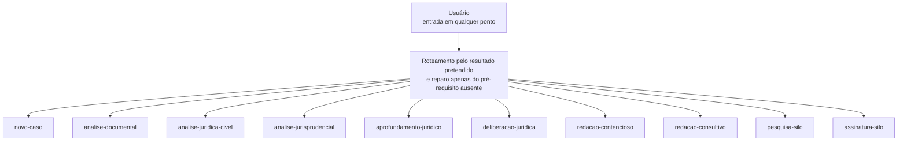

## 2. Compatibilidade entre artefatos e skills

Este é um grafo de **handoffs consumíveis**, não uma sequência que todo usuário
deva percorrer. Cada skill pode encerrar a tarefa depois de produzir seu próprio
resultado.

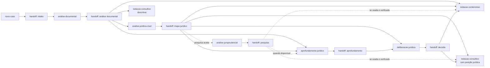

## 3. Gates compartilhados antes da redação

O protocolo de deliberação continua sendo referência compartilhada. A skill
`deliberacao-juridica` o embrulha e produz o mesmo handoff `decisão`.

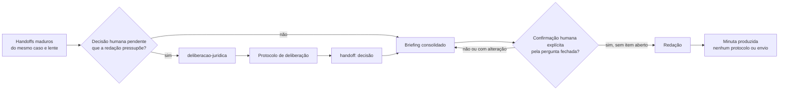

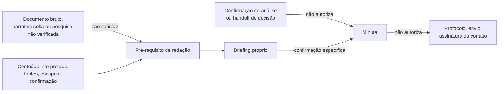

## 4. Infraestrutura compartilhada e Silo

Com acesso a 100% da infraestrutura, o conector autenticado fica disponível às
capacidades que expressamente o usam. O servidor, a base e a API do Silo
continuam sendo serviço separado deste repositório.

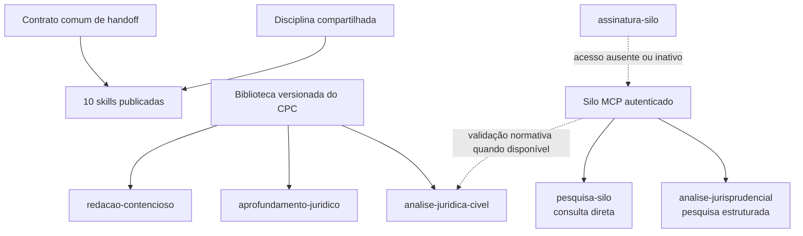

## 5. Modos e módulos das skills não contenciosas

### 5.1 Novo caso

Os três eixos são independentes. O modo de persistência depende da capacidade
comprovada do ambiente.

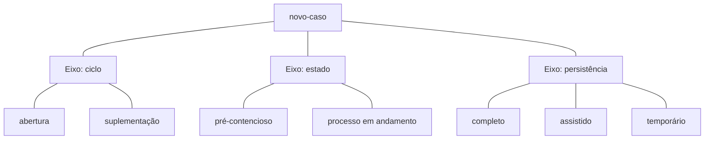

### 5.2 Análise documental

Os módulos são carregados somente quando materiais ao pedido.

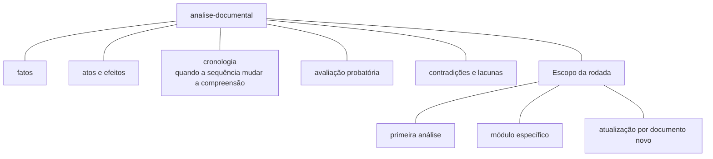

### 5.3 Análise jurídica cível

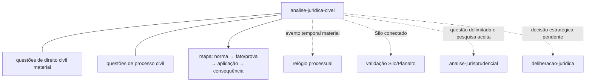

### 5.4 Análise jurisprudencial, pesquisa e acesso ao Silo

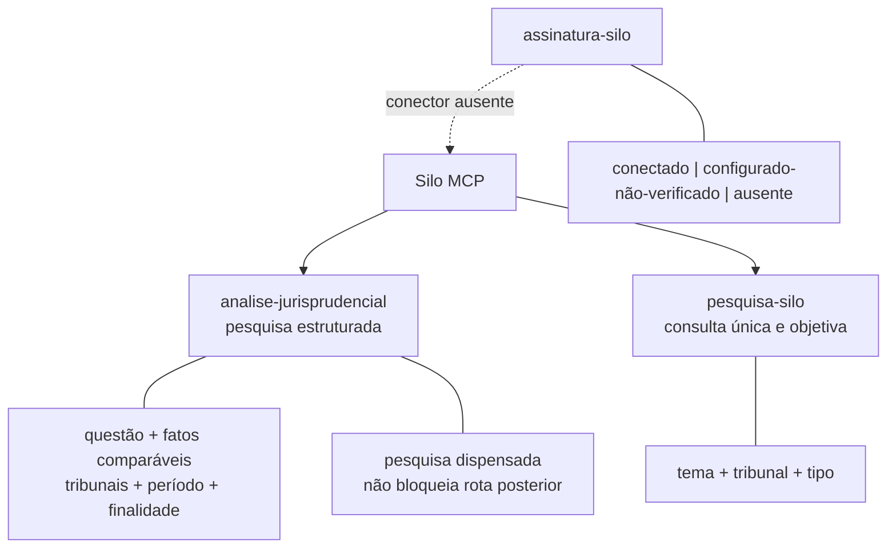

### 5.5 Aprofundamento jurídico

Escolhe-se um modo como eixo principal; artefatos podem ser combinados quando o
objetivo exigir.

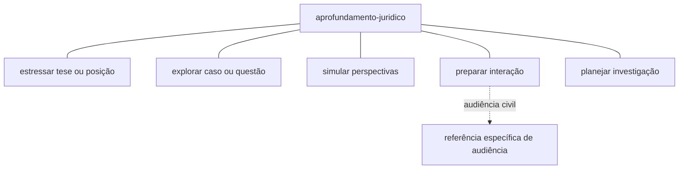

### 5.6 Deliberação jurídica

A skill usa o protocolo compartilhado e não pesquisa, aprofunda ou
redige. A saída é sempre um handoff de decisão ou uma rota explícita de retorno.

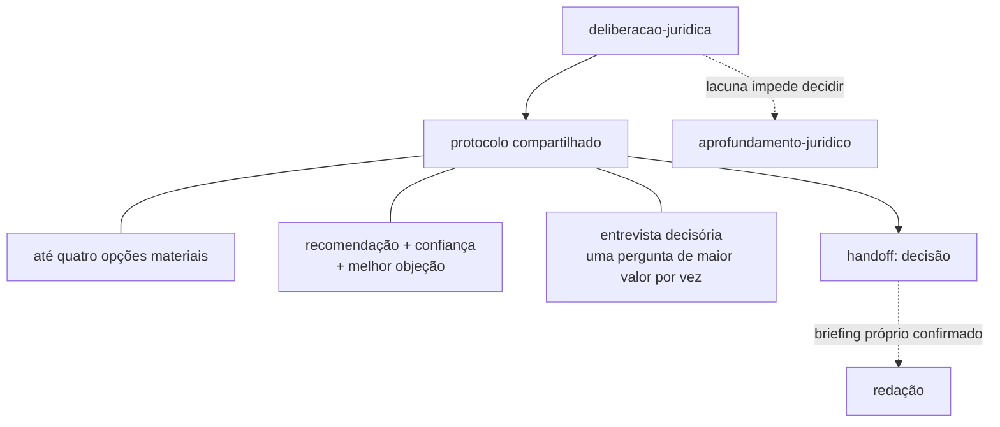

### 5.7 Redação consultiva

Tipo e profundidade são eixos independentes. O diagrama não gera combinações
prováveis entre eles.

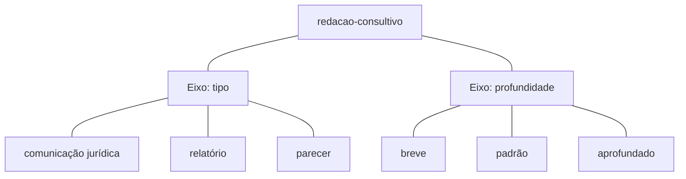

## 6. Redação contenciosa: regra de composição

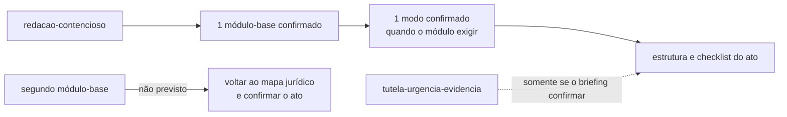

As conexões nas subseções seguintes são apenas de pertencimento ao grupo do
[índice de módulos](../skills/redacao-contencioso/references/indice-modulos.md).
Não há arestas entre atos processuais.

### 6.1 Procedimento comum e prova

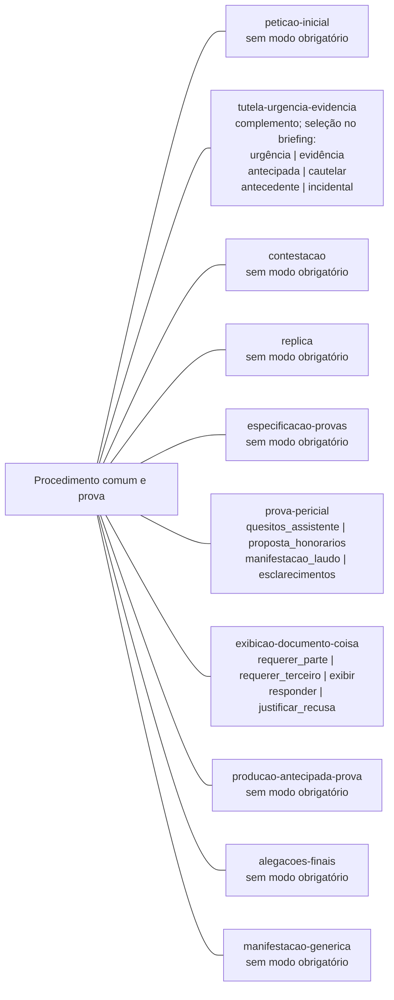

### 6.2 Incidentes, composição, liquidação e satisfação

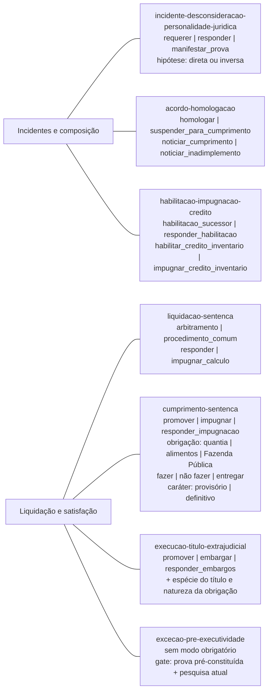

### 6.3 Recursos e impugnação autônoma

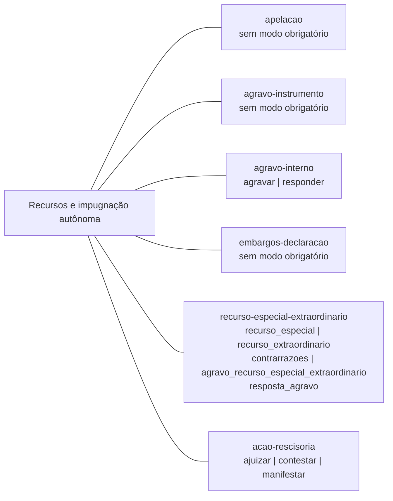

### 6.4 Procedimentos especiais contenciosos

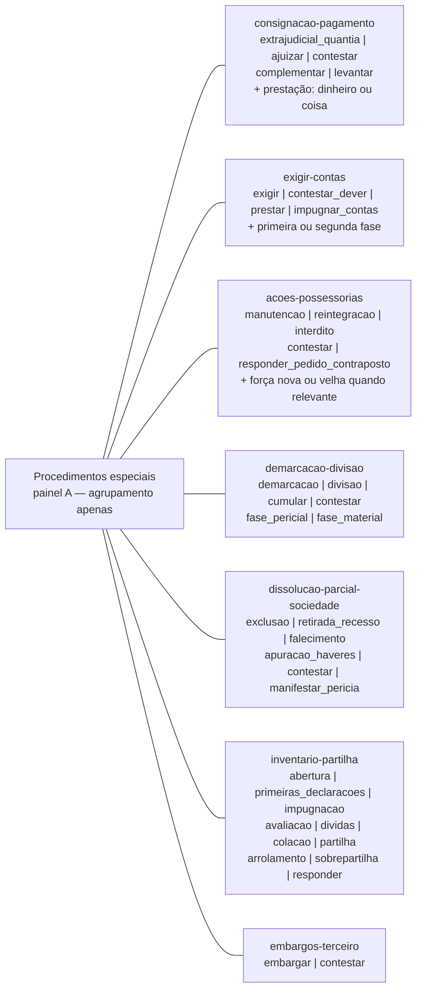

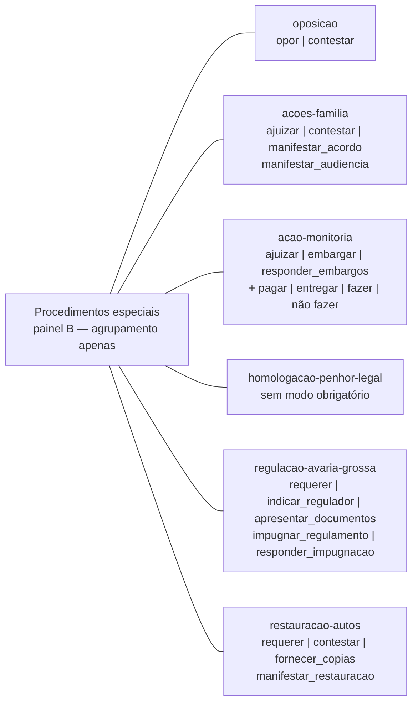

### 6.5 Jurisdição voluntária

O módulo-base é único e exige exatamente um dos treze modos abaixo.

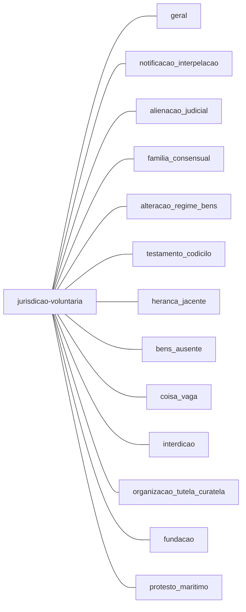

## 7. Fronteiras preservadas pelo mapa

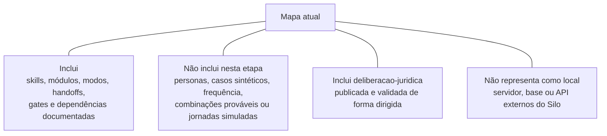
