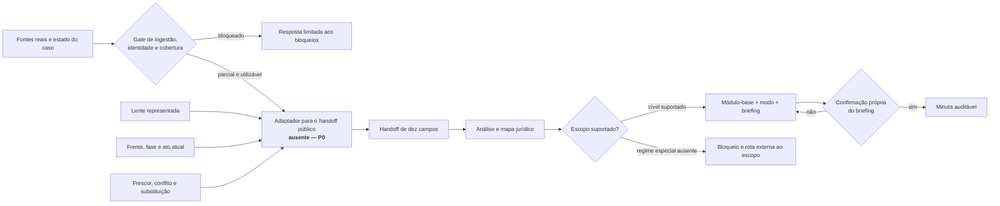

# Validação estrutural com casos reais

Auditoria local e anonimizada realizada em 2026-08-30 para confrontar a
infraestrutura pública deste repositório com situações documentadas em casos
reais. O corpus privado permaneceu fora do projeto; este documento registra
somente classes abstratas, contagens agregadas e conclusões de produto.

## Conclusão executiva

**Conclusão geral — confiança alta:** a infraestrutura tem um núcleo coerente
para análise e redação cível, mas ainda não está pronta para sustentar uma
promessa de atendimento integral de casos reais. O principal defeito não é a
quantidade de módulos de peça. É a ausência de uma ponte determinística entre o
estado vivo do caso e o contrato público de handoff.

O resultado deve ser lido em quatro camadas separadas:

1. **Núcleo cível:** os contratos de análise, deliberação, briefing e redação
   são compatíveis com atos reais de procedimento comum, tutela, exibição,
   monitória, cumprimento e inventário.
2. **Integração:** lente representada, frente ativa, ato atual, conflito entre
   fontes e frescor não chegam hoje ao fluxo público em formato confiável.
3. **Escopo:** tributário e fazendário especial, execução fiscal, trabalhista,
   criminal, busca e apreensão fiduciária e precatórios não estão cobertos de
   ponta a ponta pela skill cível.
4. **Prova de funcionamento:** não houve execução das skills contra modelo nem
   geração de peça real nesta rodada. A auditoria valida compatibilidade
   estrutural; não prova comportamento runtime, qualidade textual ou aprovação
   profissional de uma minuta.

Consequentemente, nenhum dos cenários examinados prova hoje o fluxo completo,
da fonte real até a minuta confirmada. Há encaixes materiais fortes, mas todos
dependem de extensão de integração, resolução de inconsistência, aquisição de
evento atual ou roteamento explícito para fora do escopo.

## Fronteira da prova

### O que foi examinado

- o contrato público das nove skills;
- os 37 módulos de `redacao-contencioso` e seus modos;
- a disciplina compartilhada, o handoff de dez campos e o protocolo de
  deliberação;
- o estado local de ingestão, cobertura, identidade, enriquecimento e validação
  humana de 259 casos privados;
- 405 manifestos; uma varredura estruturada de 9.062 artefatos Markdown, entre
  9.721 arquivos presentes em `outputs`, terminou sem erro de parsing na
  população examinada;
- uma amostra estratificada de 14 situações reais, todas aptas para leitura
  local, mas com cobertura material parcial.

### O que esta auditoria não prova

- completude de qualquer processo real;
- acerto jurídico final de estratégia, prazo, cálculo ou tese;
- vigência de lei material, regra local, regimento ou precedente;
- paridade com índice ou runtime remoto;
- comportamento de um modelo ao seguir as skills;
- qualidade de uma minuta, porque nenhuma foi gerada;
- confirmação humana de achados individuais só porque o caso recebeu um
  estado operacional agregado.

A comparação entre casos foi usada exclusivamente para avaliar cobertura das
skills. Nenhum achado transversal foi tratado como prova jurídica em um caso.

## Estado do corpus usado como teste

Os números abaixo pertencem a verificações distintas e não devem ser fundidos
como se fossem o mesmo recibo:

| Verificação local | Resultado | O que significa |
|---|---:|---|
| Auditoria composta de ingestão | 237 aptos; 22 bloqueados | Integridade mínima dos artefatos e controles examinados |
| Projeção local de answerability | 259 consistentes; 0 divergências | As superfícies locais reproduzem o estado canônico declarado |
| Cobertura material nessa projeção | 238 parciais; 21 bloqueadas | Nenhum caso foi declarado como material integral |
| Gate estrito de resposta material | 40 liberados; 219 não liberados | Condição mais restritiva que a auditoria composta de ingestão |
| Validação humana agregada | 6 validados; 253 em rascunho de agente | Confirmação humana é excepcional no corpus atual |
| Amostra aprofundada | 14 casos | Todos liberados no gate estrito e todos de cobertura parcial |
| Validação humana na amostra | 4 casos | Estado do caso, não confirmação automática de cada achado interno |

Os 22 casos bloqueados foram úteis para validar comportamento fail-closed, mas
não podem sustentar conclusão sobre capacidade jurídica. Os bloqueios incluem
lacuna de fonte, incompatibilidade de identidade, material truncado ou
suspeito, ausência de avaliação de busca e pendência de liberação.

Uma auditoria determinística de enriquecimento atribuiu média normalizada de
6,97/10 ao conjunto e nenhum caso alcançou 8/10. Essa métrica mede presença de
contratos e superfícies, não qualidade jurídica. As faltas recorrentes foram
frescor, ledger de alegações, canvas do caso, semântica documental, referências
de evidência e relações entre frentes.

## Método de validação

A amostra não é estatística. Ela foi escolhida para maximizar variedade de
fase, lente, espécie documental, regime jurídico e dificuldade operacional.
Por isso, a quantidade de cenários em cada resultado **não é taxa de sucesso**
nem estimativa de frequência no acervo.

Cada cenário foi confrontado com onze dimensões:

| Dimensão | Pergunta de validação |
|---|---|
| A — fonte | Identidade, proveniência e cobertura permitem usar o material? |
| B — entrada | O pedido em linguagem natural pode chegar à capacidade correta? |
| C — handoff | Lente, fontes, escopo, achados, estados, confirmação e lacunas sobrevivem à transferência? |
| D — mapa jurídico | O regime material e processual necessário está coberto? |
| E — pesquisa | A skill identifica pesquisa, lei atual, regra local ou regimento obrigatórios? |
| F — decisão | Alternativas e escolhas humanas ficam separadas da autorização de redigir? |
| G — ato | O módulo-base e o modo correspondem ao ato atual, e não apenas ao tipo histórico do processo? |
| H — briefing | O briefing exige os fatos, provas, pedidos, prazo e escolhas materiais do ato real? |
| I — redação | Estrutura e checklist alcançam os riscos observados no ato? |
| J — atualização | Documento novo, frente dependente ou evento superveniente atualizam o estado sem apagar conflito? |
| K — resultado | Qual classificação é sustentada pelas dimensões anteriores? |

Classificações usadas:

- **válido:** o fluxo atual cobre o ato e seus pré-requisitos sem lacuna
  estrutural observada;
- **válido com extensão:** o núcleo cobre o ato, mas precisa de uma camada de
  integração ou apoio claramente delimitada;
- **incompleto:** uma capacidade necessária dentro da promessa declarada está
  ausente;
- **inconsistente:** duas superfícies podem levar o fluxo a conclusões
  incompatíveis sem regra suficiente de precedência;
- **fora do escopo declarado:** o regime não pertence à skill cível atual;
- **não validável por fonte:** falta o documento ou evento que determina a
  conclusão atual.

Além do resultado, cada falha foi atribuída a uma origem: contrato da skill,
integração, corpus/fonte, limite intencional de escopo ou falta de recibo de
validação. Essa separação evita “corrigir” uma fonte ausente criando prosa, ou
tratar um regime jurídico novo como simples ajuste de prompt.

## Resultado dos 14 cenários

Os identificadores abaixo não correspondem a nomes, números ou chaves do
corpus privado.

| ID | Situação real anonimizada | Encaixe atual | Resultado do ecossistema | Razão determinante |
|---|---|---|---|---|
| R01 | Inadimplemento contratual, garantia e pedido de constrição cautelar | `peticao-inicial` + `tutela-urgencia-evidencia`; possível IDPJ após decisão própria | **Válido com extensão** | Ato e requisitos estão cobertos, mas bases monetárias, papel de garantidor e prova visual permanecem conflitantes ou incompletos; falta ponte de cálculo e evidência |
| R02 | Controvérsia tributária administrativa com alternativa entre mandado de segurança e ação comum | Análise cível reconhece lacuna, mas não contém o regime material e público necessário | **Fora do escopo declarado** | Exige direito tributário, autoridade coatora, decadência, lei municipal e pesquisa atual próprias |
| R03 | Defesa em demanda de protesto após acervo inicialmente organizado pela narrativa adversa | `contestacao` e, para o ato simples atual, `manifestacao-generica` | **Inconsistente na integração** | A lente defensiva posterior convive com matriz anterior redigida pela ótica da parte contrária; não existe regra operacional que impeça a promoção do artefato antigo |
| R04 | Litígio de vizinhança com reconvenção, prova técnica, tutela e possível recurso | `replica`, `prova-pericial`, `tutela-urgencia-evidencia` e `agravo-instrumento`, cada qual em sua frente | **Inconsistente na integração** | Fonte posterior altera presença de anexos e efeito da tutela, mas artefato antigo continua afirmando estado superado; vídeo e imagem não foram cobertos textualmente |
| R05 | Exibição autônoma de documentos, seguida por petição intermediária simples de citação | `exibicao-documento-coisa` para a ação-base; `manifestacao-generica` para o ato atual | **Válido com extensão** | O catálogo cobre ambos, mas o classificador documental chamou a manifestação intermediária de “petição inicial”; falta roteamento pelo objetivo operativo |
| R06 | Ação monitória já sentenciada e recorrida, com sessão de julgamento sem resultado incorporado | `acao-monitoria`, `apelacao` e rota recursal futura condicionada | **Não validável por fonte atual** | Sem resultado colegiado e publicação não é possível escolher redação; uma peça histórica ainda contém conflito formal de número processual que precisa ser exposto |
| R07 | Cumprimento de sentença com proposta parcelada e concordância condicional | `manifestacao-generica` para concordância simples; `cumprimento-sentenca` apenas para o incidente executivo correspondente | **Válido com extensão** | O catálogo evita inflar o ato, mas falta máquina de estados para distinguir proposta, concordância, homologação, pagamento e saldo |
| R08 | Inventário com dependência histórica externa já resolvida | `inventario-partilha` | **Válido com extensão** | O módulo alcança o ato, mas o handoff precisa suportar inventariante e interessados sem forçar modelo autor-réu; tributo, certidões e quinhões exigem apoio próprio |
| R09 | Ação de cancelamento de protesto com tutela, sem decisão posterior no acervo local | `peticao-inicial` + `tutela-urgencia-evidencia` | **Não validável por fonte atual** | A estrutura inicial é compatível, mas não há prova local do resultado da tutela nem do saneamento de custas; pagamento de guia não equivale automaticamente a regularização |
| R10 | Busca e apreensão fiduciária ligada a consórcio, depósitos e restituição | Há sobreposição genérica com defesa e manifestação | **Fora do escopo declarado** | O procedimento depende de legislação extravagante, precedentes qualificados e estados próprios de purgação, restituição e depósito |
| R11 | Execuções fiscais municipal e federal reunidas operacionalmente | `excecao-pre-executividade` cobre apenas um possível ato e exige pesquisa atual | **Fora do escopo declarado** | LEF, CTN, CDAs, redirecionamento, parcelamento, prescrição e dois processos autônomos excedem o fluxo cível geral |
| R12 | Reclamação trabalhista em fase recursal | Nenhum módulo trabalhista | **Fora do escopo declarado** | Recurso ordinário, mídia do PJe, prazos e recursos superiores trabalhistas não podem ser roteados pelos módulos recursais cíveis |
| R13 | Execução penal após pagamento e declaração de extinção | Nenhum módulo criminal ou de execução penal | **Fora do escopo declarado** | O módulo cível de cumprimento de sentença seria uma seleção materialmente errada |
| R14 | Precatório com cessões, sucessão e dois créditos sob a mesma requisição | Sobreposição parcial com cumprimento contra a Fazenda e habilitação | **Fora do escopo end-to-end** | Depósito, retenção, ordem de pagamento, cessão, sucessão e saldo exigem ledger de crédito e regime público especial; os módulos genéricos não bastam |

Não há cenário classificado como “válido” sem ressalva. Isso decorre de três
fatores diferentes, que não podem ser confundidos: a cobertura parcial do
corpus, a ausência do adaptador de integração e os regimes que o produto ainda
declara fora de escopo.

## O que os casos provaram sobre os módulos existentes

### Tutela não é o gargalo principal

O módulo de tutela exige probabilidade, perigo ou hipótese de evidência,
natureza antecipada ou cautelar, caráter antecedente ou incidental,
reversibilidade, risco adverso, contraditório e comando executável. Esses
campos respondem aos problemas reais observados.

A lacuna aparece antes: o fluxo precisa saber se a tutela ainda vigora, foi
suspensa, perdeu objeto ou pertence a outra frente. Sem estado temporal, um
módulo juridicamente correto pode redigir a providência errada.

### A manifestação genérica deve continuar genérica

Atos reais de ciência, juntada, pedido de citação e concordância condicional
cabem no módulo existente. Criar um módulo para cada petição intermediária
seria erro de produto. O necessário é classificar o ato pelo evento que o
gerou, objetivo, pedido e efeito, sem confiar no título extraído do PDF.

### Um caso pode exigir vários módulos sem permitir uma peça monolítica

Réplica, resposta à reconvenção, prova pericial, tutela e agravo podem coexistir
no mesmo caso, mas pertencem a atos ou frentes diferentes. A regra pública de
um módulo-base por peça está correta. O que falta é representar as frentes para
que o roteador selecione uma de cada vez.

### Cálculo não pode ser improvisado pela redação

Valores reais surgiram como valor histórico, valor alegado, valor reconhecido,
depósito, pagamento, levantamento e saldo. A decisão anterior de manter cálculo
fora da skill de redação foi correta. A lacuna é uma ponte reproduzível, com
data-base, índice, juros, eventos e recibo de conferência.

### Procedimento especial não se resolve com um rótulo genérico

Busca e apreensão fiduciária, execução fiscal, trabalhista, execução penal e
precatório não devem cair em contestação, apelação ou cumprimento cíveis apenas
por semelhança nominal. Até existirem skills próprias, o comportamento correto
é detectar o regime, declarar o limite e bloquear a redação inadequada.

## Lacunas priorizadas

### P0 — bloqueiam validação confiável

1. **Adaptador `fs.brain → handoff público`.** Deve ler identidade, lente,
   cobertura, fontes, estados, validação humana e bloqueios; emitir os dez
   campos públicos; preservar `parcial` e `bloqueado`; e nunca converter estado
   operacional de enriquecimento em confirmação humana de cada achado.
2. **Roteador de frente e ato atual.** Deve usar processo/frente, fase, parte
   representada, evento gerador, decisão impugnada, prazo, objetivo e pedido.
   Nome de arquivo, título extraído e espécie da ação-base são apenas sinais.
3. **Regra de frescor, conflito e substituição.** Fonte posterior não apaga
   silenciosamente a anterior. O sistema precisa registrar `confirma`,
   `complementa`, `contradiz`, `substitui` ou `não afeta`, com fonte controladora
   e conclusão bloqueada quando o conflito material permanecer.
4. **Recibo end-to-end.** A infraestrutura ainda não possui execução observada
   que atravesse fonte real, handoffs, mapa, decisão quando necessária,
   briefing confirmado e minuta auditada. Esse recibo só deve ser produzido
   depois dos três itens anteriores.

### P1 — necessários para casos civis complexos e fronteiras seguras

5. **Objeto explícito de frente.** Um caso precisa representar múltiplos
   processos, recursos, reconvenção, execução, crédito, apenso e dependência sem
   misturar estados.
6. **Despachante de escopo.** Deve distinguir cível geral, regime especial
   suportado, regime não suportado e necessidade de skill própria. A saída fora
   de escopo é um resultado correto, não falha a ser mascarada.
7. **Aquisição de evidência por seção e mídia.** PDFs mistos, anexos, plantas,
   fotografias e vídeos precisam de cobertura declarada. OCR incompleto limita
   apenas o achado dependente, mas deve impedir afirmação literal ou visual.
8. **Ponte de cálculo e ledger monetário.** Deve separar origem do valor,
   natureza, data-base, atualização, pagamento, depósito, levantamento e saldo,
   com memória reproduzível e confirmação humana.
9. **Gate de prazo e direito atual.** Evento inicial, jurisdição, calendário,
   regra local, legislação extravagante e regimento devem existir antes de
   declarar prazo ou cabimento contemporâneo.
10. **Integridade formal do artefato.** Número processual, partes, qualidade,
    datas, pedidos e anexos devem ser comparados dentro da própria peça. Resíduo
    de template ou dado incompatível deve aparecer como conflito, nunca ser
    corrigido silenciosamente.

### P2 — aumentam robustez após o P0/P1

11. **Estado por achado.** A confirmação pertence a cada fato, inferência,
    hipótese, conflito ou pendência, não ao caso inteiro.
12. **Gates de pesquisa especializados.** Regimes especiais precisam tornar
    obrigatória a fonte material, local ou jurisprudencial que define o ato;
    jurisprudência genérica opcional não basta.
13. **Fixtures adversariais derivadas, mas sintéticas.** Devem reproduzir
    conflito de lente, ato mal rotulado, fonte superveniente, processo paralelo,
    valor histórico e evento ausente, sem transportar dado real.
14. **Papéis não bilaterais.** Inventariante, interessado, autoridade,
    terceiro, cessionário e sucessor precisam existir sem adaptação forçada ao
    par autor-réu.
15. **Inspeção humana de prova visual.** Quando o efeito depende de imagem,
    vídeo, planta ou assinatura ilegível, a skill deve pedir verificação do
    original e registrar seu alcance.

## Onde o fluxo quebra hoje

## Ordem recomendada de correção

A sequência mais curta que resolve causas, e não sintomas, é:

1. implementar o adaptador de handoff;
2. adicionar frente/ato atual e precedência temporal ao mesmo ponto de
   integração;
3. criar o despachante de escopo com bloqueio explícito;
4. adicionar cálculo, prazo, mídia e integridade como capacidades auxiliares,
   sem transformá-las em módulos de redação;
5. derivar fixtures sintéticas dos conflitos reais;
6. só então executar dogfood end-to-end e decidir quais regimes especiais
   justificam skills próprias.

Não se recomenda criar agora módulos para cada microato. O catálogo atual já
cobre manifestações simples e vários atos civis complexos. A próxima unidade
de trabalho deve ser a ponte que escolhe e alimenta corretamente esses módulos.

## Critério para declarar suficiência

Uma futura afirmação de que o ecossistema alcança casos reais exige, no mínimo:

- fonte e cobertura com recibo próprio;
- handoff de dez campos sem promoção de estados;
- lente e frente atuais inequívocas;
- conflito temporal resolvido ou conclusão dependente bloqueada;
- regime jurídico reconhecido como suportado ou recusado;
- módulo e modo determinados pelo ato atual;
- briefing integral confirmado em gate próprio;
- peça com fatos, fontes, localizadores e campos pendentes preservados;
- cálculo, prazo, mídia e pesquisa tratados pelas capacidades adequadas;
- auditoria humana e recibo separado de qualquer protocolo ou uso externo.

Até que esse conjunto seja observado, a formulação correta é: **infraestrutura
cível estruturalmente promissora, integração real incompleta e cobertura de
regimes especiais deliberadamente limitada**.
